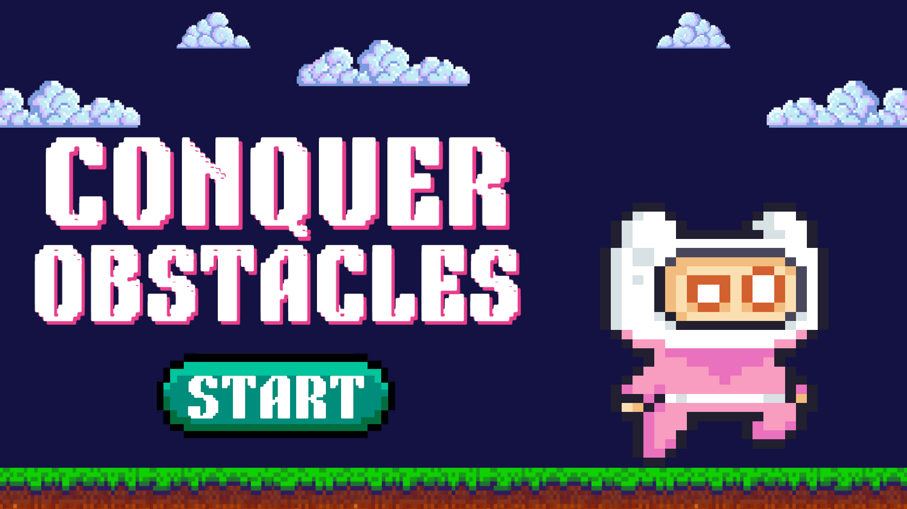
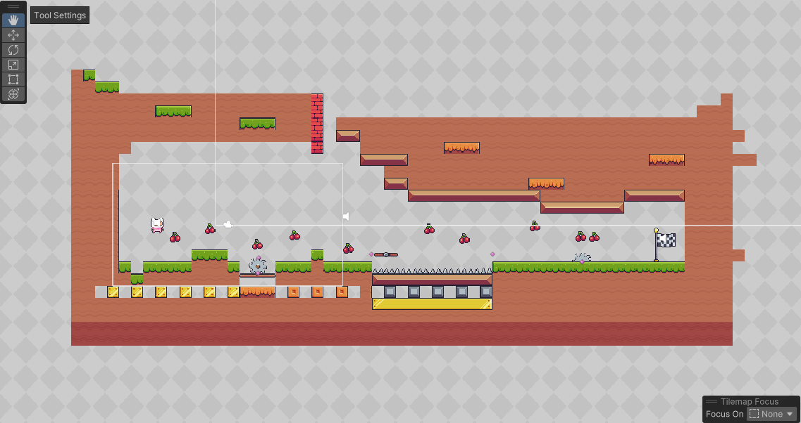
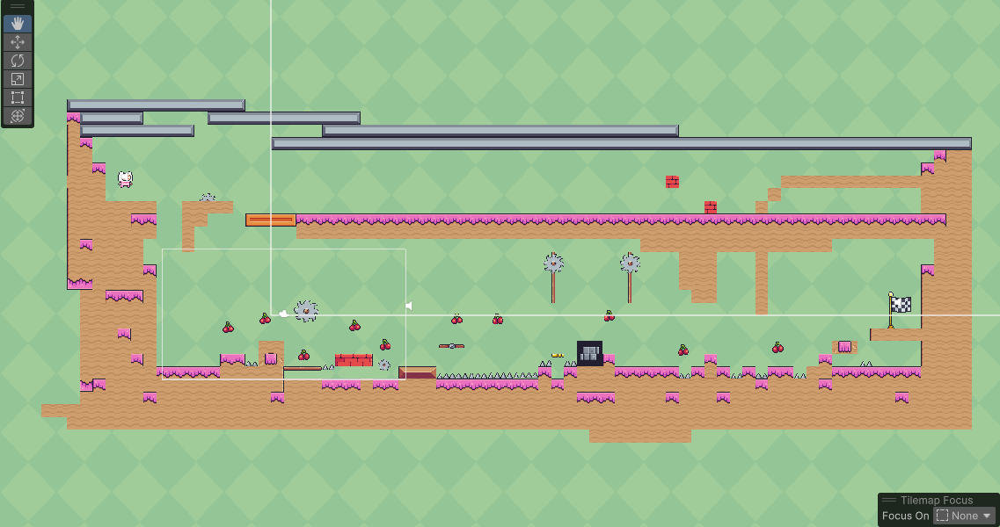
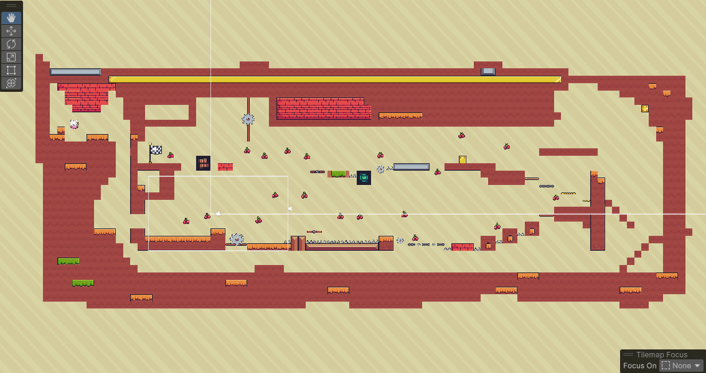
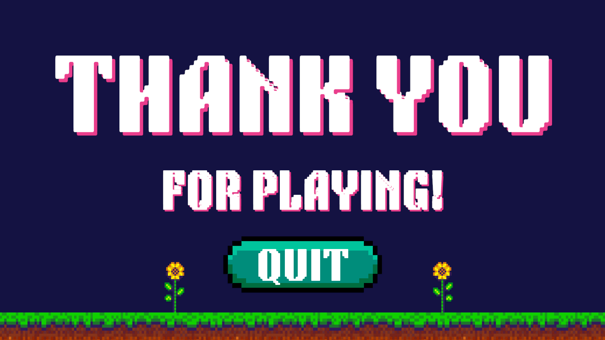

<h1>→﹐ ⛩ ﹒Conquer Obstacles﹒⟢</h1>
<h5>Conquer Obstacles atau Menaklukkan Rintangan adalah sebuah game 2D platformer yang dibuat menggunakan Unity. Dalam game ini, pemain akan mengendalikan karakter utama untuk melewati berbagai rintangan dan tantangan unik di setiap level.</h5>
<h5>Game ini terdiri dari tiga level utama, di mana setiap level memiliki desain yang berbeda, tingkat kesulitan yang meningkat, dan jenis rintangan yang semakin kompleks. Pemain ditantang untuk menggunakan kecepatan, ketepatan, dan strategi untuk menaklukkan semua rintangan hingga mencapai garis akhir.</h5>
<h3>𓍯 Fitur Utama</h3>
<h5>⤷ Kontrol permainan sederhana dan responsif.</h5>
<h5>⤷ Desain level yang bervariasi dan menantang.</h5>
<h5>⤷ Rintangan yang terus berkembang sesuai level.</h5>
<h5>⤷ Visual 2D yang menarik dan mendukung suasana permainan.</h5>
<h1></h1>
<h3>𓍯 Cara Bermain</h3>
<h5>⤷ Gerakkan player menggunakan tombol panah ← untuk ke kiri dan → ke kanan. Sedangkan untuk melompat menggunakan tombol Spasi.</h5>
<h5>⤷ Hindari rintangan.</h5>
<h5>⤷ Jika player mati karena terkena atau mengenai rintangan, maka player akan mengulang kembali pada Level tersebut.</h5>
<h1></h1>
<h3>𓍯 Desain Start Game</h3>
<h5>⤷ Tampilan awal ketika game dibuka dan untuk mulai memainkan game klik button Start.</h5>

<h3>𓍯 Desain Game Level 1</h3>
<h5>⤷ Pengenalan dasar kontrol dan rintangan ringan.</h5>

<h3>𓍯 Desain Game Level 2</h3>
<h5>⤷ Tantangan mulai meningkat dengan elemen baru.</h5>

<h3>𓍯 Desain Game Level 3</h3>
<h5>⤷ Level tersulit dengan kombinasi rintangan kompleks.</h5>

<h3>𓍯 Desain Game Over</h3>
<h5>⤷ Tampilan akhir ketika player sudah menyelesaikan game dan jika ingin memainkan game ini kembali maka player bisa mengklik button .</h5>

<h1></h1>
<h3>𓍯 Demo</h3>
<h5>⤷ Untuk memainkannya anda harus mengunduh repository GitHub dalam format ZIP.</h5>
<h5>⤷ Berikut langkah-langkah yang harus anda lakukan untuk memainkan game ini :</h5>
<h6>✦ Download repository Github dalam format ZIP.</h6>
<h6>✦ Selesai mendownload, ekstrak file ZIP.</h6>
<h6>✦ Jika sudah di ekstrak, buka folder dan double klik aplikasi BelajarPengembangan.</h6>
<h6>✦ Tunggu sebentar dan game siap dimainkan.</h6>
<h1></h1>
